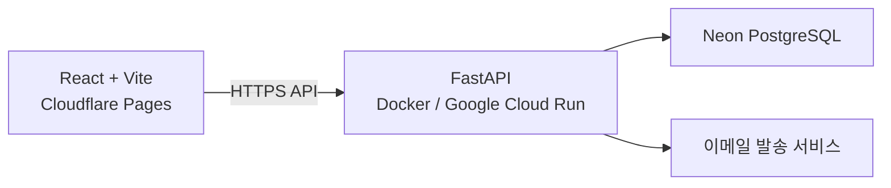

# MD2Blog 제품 및 아키텍처

## 1. 문서 목적

이 문서는 MD2Blog의 제품 정책, 도메인 규칙, 아키텍처 경계, 기술적 의사결정과
트레이드오프를 정의합니다. 구현 진행 상황, 데이터 전환 절차, 배포 절차와 작업
목록은 이 문서에서 다루지 않습니다.

MD2Blog는 빠른 Markdown 변환 기능과 사용자별 Markdown 기록장을 함께 제공합니다.
비로그인 사용자는 임시 Markdown 페이지 한 개를 사용할 수 있습니다.

## 2. 제품 방향

### 2.1 빠른 변환

로그인 여부와 관계없이 Markdown 변환 기능을 이용할 수 있습니다.

- Markdown 입력 및 파일 업로드
- 실시간 HTML 미리보기
- Mermaid 렌더링
- Mermaid 다이어그램별 PNG 복사
- 미리보기 내용 복사
- HTML 및 PDF 다운로드
- 네이버 블로그 변환 모드

변환 옵션은 별도의 적용 버튼 없이 변경 즉시 미리보기에 반영합니다.

미리보기 전체를 복사할 때 Mermaid 이미지는 용량과 블로그 호환성 문제를 방지하기 위해 제외하거나 자리 표시자로 대체합니다. 각 Mermaid 영역의 PNG 복사는 별도의 아이콘 버튼으로 제공합니다.

### 2.2 내 기록장

비로그인 사용자도 `내 기록장`에서 임시 Markdown 페이지 한 개를 작성할 수 있습니다. 인증을 완료하면 임시 페이지의 내용을 사용자의 기록장으로 이전할 수 있습니다.

로그인 사용자는 Notion과 유사한 개인 Markdown 기록장을 이용할 수 있습니다.

- 최상위 페이지 추가
- 하위 페이지 추가
- 페이지 이동 및 정렬
- 페이지별 Markdown 작성
- 작성 내용 실시간 미리보기
- 계층형 페이지 탐색
- 자동 저장

### 2.3 비회원 임시 페이지

비로그인 사용자에게는 다음 정책을 적용합니다.

- 임시 페이지는 브라우저당 한 개만 제공합니다.
- 페이지명은 `임시 페이지`로 고정하며 빠른 변환에서 불러온 파일명으로 변경하지 않습니다.
- Markdown 편집과 실시간 미리보기를 지원합니다.
- 작성 내용은 브라우저의 IndexedDB에 자동 저장합니다.
- 페이지 계층, 페이지 이동, 여러 페이지 생성은 지원하지 않습니다.
- 다른 기기나 브라우저와 동기화하지 않습니다.
- 브라우저 데이터 삭제 및 시크릿 모드 종료 시 내용이 사라질 수 있음을 안내합니다.
- 새 페이지 추가 등 회원 전용 기능을 선택하면 현재 내용을 유지한 채 로그인 화면으로 이동합니다. 신규 사용자는 로그인 화면에서 회원가입으로 이동할 수 있습니다.

로그인 또는 회원가입 완료 후 임시 페이지가 있으면 기록장으로 이전할지 확인합니다.

- 사용자가 이전에 동의하면 최상위 페이지 한 개로 생성합니다.
- 임시 페이지의 Markdown 본문을 그대로 이전합니다. 계정 페이지의 제목 정책은 이전 유스케이스에서 결정합니다.
- 중복 생성을 방지할 수 있도록 이전 요청에 멱등성 키를 사용합니다.
- 서버 저장이 성공한 뒤에만 IndexedDB의 임시 데이터를 삭제합니다.
- 이전이 실패하면 임시 데이터를 유지하고 다시 시도할 수 있도록 합니다.
- 사용자가 이전하지 않으면 임시 페이지를 즉시 삭제하지 않고 명시적으로 삭제할 수 있게 합니다.

## 3. 화면 구성

빠른 변환과 내 기록장은 각 작업에 맞는 화면 구조를 사용하되, 상단 내비게이션과 시각적 스타일을 공유합니다.

- 빠른 변환: 상단 내비게이션, 왼쪽 변환 설정, 오른쪽 미리보기
- 내 기록장: 상단 내비게이션, 왼쪽 페이지 트리, 중앙 Markdown 편집기, 오른쪽 미리보기
- 비회원 임시 페이지: 기록장 편집 화면을 사용하되 `모든 페이지`, `최근 변경`, 페이지별 작업 메뉴는 표시하지 않고 임시 페이지와 로그인 동선을 제공합니다.

상단 내비게이션에는 로그인 여부와 관계없이 `빠른 변환`과 `내 기록장`을 표시합니다. 모바일에서는 페이지 트리를 드로어 형태로 제공합니다.

비회원 화면의 페이지 영역 `+` 버튼과 임시 페이지 안내 동선은 로그인 화면으로 이동합니다. 상단 브랜드명은 내비게이션 링크로 사용하지 않습니다.

Markdown 편집기와 미리보기 사이에는 다음 정책의 리사이즈 핸들을 제공합니다.

- 포인터 드래그와 좌우 방향키로 너비를 조절합니다.
- 에디터와 미리보기의 최소 너비를 보장합니다.
- 더블 클릭하면 기본 비율로 복원합니다.
- 조절한 비율은 현재 브라우저에 저장합니다.
- 리사이즈 전후 에디터와 미리보기의 독립 스크롤을 유지합니다.

### 3.1 빠른 변환에서 기록장에 저장

비회원이 빠른 변환의 `기록장에 저장`을 선택하면 즉시 저장하지 않고 저장 방식을 확인합니다.

- `임시 페이지를 현재 내용으로 교체`를 기본값으로 제공합니다.
- 기존 내용이 있을 때 교체 경고를 표시합니다.
- `임시 페이지에 내용 추가`는 기존 본문 뒤에 빈 줄을 추가한 후 현재 Markdown을 이어 붙입니다.
- 두 방식 모두 페이지명은 `임시 페이지`로 유지합니다.
- 저장을 확정한 뒤 `내 기록장`으로 이동합니다.

### 3.2 로그인 사용자 기록장 페이지 생성 UI

- 페이지 영역 우측의 `+` 버튼으로 최상위 페이지를 생성합니다.
- 각 페이지에 마우스를 올리면 `+`와 `⋮` 버튼을 표시합니다.
- 페이지별 `+` 버튼으로 해당 페이지의 하위 페이지를 생성합니다.
- `⋮` 메뉴에서 이름 변경, 이동, 복제, 삭제를 제공합니다.
- 페이지는 드래그 앤 드롭 또는 이동 메뉴를 통해 계층과 순서를 변경할 수 있습니다.
- 자기 자신 또는 자신의 자손 아래로 이동하는 순환 구조는 허용하지 않습니다.
- 페이지 계층의 저장 깊이는 제한하지 않되, 깊은 단계에서도 사이드바 너비가 지나치게 줄어들지 않도록 들여쓰기를 제한합니다.

## 4. 시스템 구성



### 4.1 프론트엔드

- React
- Vite
- TypeScript
- Cloudflare Pages 배포
- 빠른 변환은 로그인 없이 사용 가능
- 비회원 임시 페이지는 IndexedDB에 저장
- 기록장 기능은 FastAPI 인증 및 기록장 API 사용

MD2Blog는 검색 엔진 노출보다 애플리케이션 상호작용이 중요하므로 SSR을 목적으로 Next.js를 도입하지 않습니다.

### 4.2 백엔드

- Python
- FastAPI
- Docker 컨테이너
- Google Cloud Run 배포
- SQLAlchemy
- Alembic
- Pydantic

FastAPI는 인증, 사용자, 기록장, 페이지, 저장 등의 서버 기능을 담당합니다.

### 4.3 데이터베이스

- Neon PostgreSQL 사용
- 애플리케이션 서버와 DB를 분리해 운영
- Cloud Run 컨테이너 내부에서 PostgreSQL을 운영하지 않음

## 5. 백엔드 아키텍처

초기에는 마이크로서비스 대신 DDD 기반 모듈러 모놀리스로 구성합니다.

```text
backend/
├── src/md2blog/
│   ├── modules/
│   │   ├── identity/
│   │   │   ├── domain/
│   │   │   ├── application/
│   │   │   ├── infrastructure/
│   │   │   └── presentation/
│   │   └── workspace/
│   │       ├── domain/
│   │       ├── application/
│   │       ├── infrastructure/
│   │       └── presentation/
│   ├── shared/
│   ├── presentation/
│   └── main.py
├── migrations/
├── tests/
│   ├── unit/
│   ├── integration/
│   └── acceptance/
├── Dockerfile
└── pyproject.toml
```

### 5.1 Bounded Context

#### Identity

- 사용자
- 비밀번호 자격 증명
- 로그인 세션
- 외부 인증 제공자 연결
- 이메일 인증
- 비밀번호 재설정
- 로그인 보안 상태

#### Workspace

- 기록장
- 페이지
- 페이지 계층
- Markdown 본문
- 페이지 순서

비회원 임시 페이지는 서버의 Workspace 엔티티로 저장하지 않습니다. 인증 후 사용자가 이전에 동의하는 시점에 인증된 사용자의 페이지 생성 유스케이스로 전달합니다.

### 5.2 의존성 규칙

- Domain은 FastAPI, SQLAlchemy, Pydantic에 의존하지 않습니다.
- Application은 유스케이스와 트랜잭션 경계를 정의합니다.
- Infrastructure는 DB, 암호화, 메일 등 외부 구현을 담당합니다.
- Presentation은 HTTP 요청과 응답을 애플리케이션 유스케이스에 연결합니다.
- SQLAlchemy 모델과 도메인 엔티티를 분리합니다.
- HTTP 입력 모델과 Inbound Port는 `application/port/inbound`에 두고 Pydantic으로
  전송 형식을 검증합니다.
- 프레임워크 독립적인 변경 명령은 `domain/commands.py`의 dataclass로 정의합니다.
- Presentation은 HTTP DTO를 Command로 변환하고 UseCase에는 Command 하나를 전달합니다.
- DB 조회가 필요한 Command 조립은 `application/factory`가 담당합니다.
- 조회 결과인 `PageListItem`, `PageDetail`은 `application/model`에 둡니다.

아키텍처는 특정 배포 환경을 기준으로 역산하지 않습니다. Cloud Run, Cloud Logging,
Cloud Scheduler, Gmail SMTP, Neon은 도메인과 애플리케이션에서 정의한 요구사항을
구현하는 Infrastructure Adapter입니다. 배포 대상이나 외부 제품을 교체하더라도
도메인 정책과 유스케이스의 의미가 유지되어야 합니다.

### 5.3 Workspace 저장 구조

페이지의 계층·제목·정렬 정보와 크기가 커질 수 있는 Markdown 본문을 물리적으로 분리합니다.

```text
pages
- id
- owner_id
- parent_id
- title
- sort_order
- created_at
- updated_at
- deleted_at (nullable)

page_contents
- page_id (PK, FK -> pages.id, ON DELETE CASCADE)
- content
- created_at
- updated_at
```

- `pages.parent_id`는 같은 테이블의 `id`를 참조하여 페이지 계층을 표현합니다.
- `page_contents.page_id`는 페이지와 일대일 관계이며 페이지 삭제 시 함께 삭제됩니다.
- `pages.deleted_at`이 없으면 활성 페이지, 값이 있으면 휴지통 페이지입니다.
- 페이지를 삭제하면 해당 페이지와 모든 하위 페이지에 같은 삭제 시각을 기록합니다.
- 삭제일로부터 30일이 지난 페이지는 정기 정리 작업에서 하드 삭제하며 본문도 함께 삭제됩니다.
- 페이지 생성 시 메타데이터와 본문을 같은 트랜잭션에서 저장합니다.
- 목록 조회는 `pages`에서 필요한 컬럼만 선택하고 본문 테이블을 조인하지 않습니다.
- 상세 조회와 본문 수정에서만 `page_contents`에 접근합니다.
- 애그리거트 루트인 `Page`는 `PageContent`를 항상 포함하며 불완전한 상태를 허용하지 않습니다.
- `PageRepository`는 완전한 도메인 모델을, `PageQueryRepository`는 조회 목적에 맞는
  `PageListItem` 또는 `PageDetail`을 반환합니다.

### 5.4 Workspace API

```text
POST   /workspace/pages
GET    /workspace/pages
GET    /workspace/pages/search?q={query}
GET    /workspace/pages/{page_id}
PATCH  /workspace/pages/{page_id}
DELETE /workspace/pages/{page_id}
PATCH  /workspace/pages/{page_id}/move
GET    /workspace/trash
GET    /workspace/trash/{page_id}
POST   /workspace/trash/{page_id}/restore
DELETE /workspace/trash/{page_id}
```

- 목록 API는 `id`, `owner_id`, `title`, `parent_id`, `sort_order`만 반환합니다.
- 상세 API는 목록 필드와 Markdown `contents`를 반환합니다.
- 검색 API는 활성 페이지의 제목과 Markdown 본문을 검색하고 최대 50개의 목록 필드만 반환합니다.
- 검색 결과는 평면 목록으로 표시하되 프론트엔드의 페이지 목록을 이용해 상위 페이지 경로를 함께 표시합니다.
- 프론트엔드는 목록 응답을 먼저 표시하고 선택한 페이지의 상세를 지연 조회합니다.
- 조회한 본문은 현재 애플리케이션 세션의 메모리에 캐시하여 같은 페이지 재선택 시 재사용합니다.
- 모든 조회와 변경은 인증 사용자의 소유권을 검증합니다.
- 일반 페이지 API는 휴지통 페이지를 반환하지 않습니다.
- 휴지통 목록은 `parent_id`, `sort_order`를 포함해 삭제된 페이지 계층 전체를 반환합니다.
- 삭제된 페이지 상세 API는 Markdown 본문을 반환하며 프론트엔드는 읽기 전용 편집기와 미리보기로 표시합니다.
- 복원과 영구 삭제는 삭제 묶음의 최상위 페이지에서 실행하며 하위 페이지에도 함께 적용합니다.
- 30일 경과 페이지는 정기 정리 작업에서 삭제합니다.

## 6. 인증 설계

인증은 Neon Auth와 같은 외부 인증 서비스에 위임하지 않고 FastAPI에서 직접 구현합니다.

### 6.1 기본 정책

- 비밀번호 해싱: Argon2id
- Access Token: 수명이 짧은 JWT
- Refresh Token: 암호학적으로 안전한 무작위 토큰
- Refresh Token 전달: `HttpOnly`, `Secure`, 적절한 `SameSite`가 설정된 쿠키
- Refresh Token 저장: 원문이 아닌 해시 저장
- 토큰 갱신: Refresh Token Rotation 적용
- 로그아웃: 현재 세션 폐기
- 전체 로그아웃: 사용자의 모든 세션 폐기
- Access Token은 브라우저 `localStorage`에 장기 보관하지 않음
- 회원가입 시 Gmail SMTP로 이메일 인증 링크 발송
- 이메일 인증 토큰은 원문이 아닌 SHA-256 해시로 저장하고 24시간 후 만료
- 인증 메일 재발송은 사용자별 대기 시간과 최근 24시간 발송 횟수로 제한
- 이메일 인증 전 사용자는 기록장 API 접근 불가

### 6.2 API 계약

```text
POST /auth/signup
POST /auth/login
POST /auth/refresh
POST /auth/logout
POST /auth/logout-all
DELETE /auth/account
GET  /auth/me
PATCH /auth/me

POST /auth/email-verification/request
POST /auth/email-verification/confirm
POST /auth/password-reset/request
POST /auth/password-reset/confirm

POST   /auth/google/login
POST   /auth/google/signup
POST   /auth/google/link-and-login
GET    /auth/google/connection
POST   /auth/google/connection
DELETE /auth/google/connection
```

회원탈퇴는 현재 비밀번호를 다시 검증한 후 `users` 행을 영구 삭제합니다. 페이지,
본문, 휴지통 데이터, 인증 토큰 및 모든 Refresh Token 세션은 외래키의
`ON DELETE CASCADE`로 같은 트랜잭션에서 제거합니다. 이후 발급된 Access Token도
사용자 조회에 실패하므로 사용할 수 없으며, 삭제된 이메일은 즉시 재가입할 수 있습니다.

### 6.3 인증 데이터 모델

```text
users
- id
- email
- password_hash
- display_name
- email_verified_at
- last_login_at
- status
- created_at
- updated_at

auth_sessions
- id
- user_id
- refresh_token_hash
- expires_at
- revoked_at
- replaced_by_token_hash
- user_agent
- ip_address
- created_at

user_identities
- id
- user_id
- provider
- provider_subject
- provider_email
- created_at

login_security_states
- user_id (PK, FK → users.id)
- failed_attempt_count
- failure_window_started_at
- blocked_until
- last_failed_at
- created_at
- updated_at

account_confirmation_tokens
- id
- user_id
- purpose (email_verification | password_reset)
- token_hash
- expires_at
- used_at
- revoked_at
- created_at
```

인증 토큰은 `purpose`별로 조회·재발송 제한·사용 검증을 분리해 서로 다른 용도의
토큰을 교차 사용할 수 없도록 합니다.

`users.last_login_at`은 새로운 로그인 세션을 만들 때 갱신합니다. 리프레시 토큰
갱신은 로그인으로 세지 않으며, 상세 로그인 이력과 별도로 마지막 성공 시각만 유지합니다.

`LoginSecurityState`는 `User`와 필수 1:1 관계를 가지는 로그인 보안 상태입니다. `User`와
같은 트랜잭션에서 생성하며, 로그인 성공 시 행을 삭제하지 않고 실패 횟수, 실패 구간,
차단 상태를 초기화합니다. 로그인 성공·실패의 과거 이력과는 별개의 모델입니다.

Google을 포함한 외부 인증 계정은 `user_identities`에 Provider와 Provider Subject를
저장합니다. Provider와 Subject 조합, 사용자와 Provider 조합은 각각 유일해야 하며,
새로운 인증 제공자는 `UserIdentity` 경계를 유지한 채 추가합니다.

### 6.4 도메인 이벤트 정책

도메인 이벤트는 다음 기준으로 인정합니다.

> 도메인 이벤트는 도메인에서 이미 발생한 의미 있는 사실이며, 상태 전이 또는 도메인
> 판단이 완료됐고, 해당 유스케이스 밖에서도 독립적인 의미를 가지는 사건입니다.

다음 조건을 함께 검토합니다.

- 과거형으로 표현할 수 있는가?
- 구현 기술이 아닌 도메인 용어로 설명할 수 있는가?
- 상태 전이 또는 도메인 판단이 완료됐는가?
- 업무 트랜잭션이 롤백되면 이벤트도 발생하지 않아야 하는가?
- 호출한 메서드 밖에서도 사건 자체로 의미가 있는가?

도메인 이벤트가 발행되면 이벤트 핸들러는 사건의 목적에 따라 다음 정책을 적용합니다.

```text
도메인 이벤트 발생·발행
        ↓
이벤트 핸들러
        ├─ 비즈니스 후속 작업이 있음
        │    → Outbox Message 저장
        │    → Worker가 후속 작업 실행
        │    → 실패하면 재시도
        │
        ├─ 보안 추적이 필요함
        │    → Security Audit Log 저장
        │
        └─ 둘 다 해당함
             → 두 곳 모두 저장
```

각 구성 요소의 책임은 다음과 같습니다.

- 도메인 이벤트는 이미 발생한 도메인의 사실입니다.
- `outbox_messages`는 유실되어서는 안 되는 비즈니스 후속 작업을 보관합니다.
- Outbox Worker와 Message Handler는 저장된 후속 작업을 실행하고 실패 시 재시도합니다.
- `security_audit_logs`는 이미 발생한 보안 사건을 추적하기 위한 변경 불가능한 이력입니다.
- 하나의 도메인 이벤트에 Outbox와 보안 감사 기록 정책을 함께 적용할 수 있습니다.
- 단순 운영·디버그 로그는 도메인 이벤트 처리 및 보안 감사 기록과 구분합니다.

모든 도메인 이벤트를 일괄적으로 영속화하지 않습니다. 비즈니스 후속 작업이 있는
이벤트는 Outbox Message로, 보안 추적이 필요한 이벤트는 Security Audit Log로 목적에
맞게 영속화합니다. 후속 작업이나 보안 감사가 필요하지 않은 이벤트는 별도로
영속화하지 않습니다.

도메인 상태 변경과 Outbox Message 및 Security Audit Log 저장은 필요한 경우 동일한
업무 트랜잭션에서 원자적으로 처리합니다. 실제 Outbox 후속 작업은 커밋 이후에
실행하며 최소 한 번 처리될 수 있으므로 Handler는 멱등하게 설계합니다. 비밀번호,
원문 확인 토큰, JWT, 세션 토큰과 같은 민감 정보는 장기 이력에 저장하지 않습니다.

모듈러 모놀리스에서는 DB 기반 Outbox와 내부 Worker로 구성합니다. MSA와 메시지
브로커를 사용하는 구조에서도 도메인 이벤트 계약을 유지하고, Outbox Relay 및 소비자
멱등성 또는 Inbox 정책을 Infrastructure에 둡니다.

도메인 이벤트 정책은 특정 배포 제품이 아니라 요구사항과 신뢰성 수준을 기준으로
결정하며, 저장소, Processor와 메시지 브로커는 이를 구현하는 Infrastructure로 둡니다.

## 7. 식별자 정책

모든 주요 엔티티의 식별자는 TSID(Time-Sorted Unique Identifier)를 사용합니다.

### 7.1 저장 및 전달

- Python 도메인 및 애플리케이션: TSID 값 객체
- PostgreSQL: `BIGINT`
- HTTP JSON: 문자열
- TypeScript: 브랜드 문자열 타입

JavaScript의 `number`는 64비트 정수를 안전하게 표현하지 못하므로 API에서 TSID를 숫자로 반환하지 않습니다.

```typescript
type TSID = string & { readonly __brand: "TSID" };
```

```json
{
  "id": "781839230418604291",
  "parentId": "781839200002013117"
}
```

여러 애플리케이션 인스턴스에서 동시에 ID를 생성할 수 있으므로 충분한 랜덤 비트를
사용하는 검증된 TSID 구현체를 사용합니다. PostgreSQL의 기본 키 제약을 최종 충돌
방어선으로 둡니다.

## 8. TDD 전략

기능은 다음 순환으로 개발합니다.

```text
실패하는 테스트 작성
→ 최소 구현
→ 테스트 통과
→ 리팩터링
```

### 8.1 단위 테스트

- 도메인 엔티티
- 값 객체
- 도메인 규칙
- 애플리케이션 유스케이스
- 외부 시스템은 테스트 대역 사용
- 임시 페이지 직렬화 및 복원
- 이전 성공 전 임시 데이터 유지

### 8.2 통합 테스트

- PostgreSQL Repository
- SQLAlchemy 매핑
- Alembic 마이그레이션
- 트랜잭션 경계
- TSID 저장 및 복원

SQLite로 PostgreSQL 동작을 대신하지 않고 테스트용 PostgreSQL을 사용합니다.

### 8.3 인수/API 테스트

- 회원가입부터 로그아웃까지의 인증 흐름
- Refresh Token 교체 및 재사용 차단
- 만료 및 폐기된 토큰 거부
- 다른 사용자의 페이지 접근 차단
- 인증 후 임시 페이지 이전
- 동일한 멱등성 키로 재시도할 때 페이지 중복 생성 방지
- 이전 실패 후 재시도 가능
- 상위·하위 페이지 생성과 이동
- Markdown 저장과 조회

## 9. 기술적 의사결정과 트레이드오프

| 결정 영역 | 선택 | 근거 | 트레이드오프 |
|---|---|---|---|
| 프론트엔드 | React + Vite + TypeScript | 상호작용 중심의 클라이언트 애플리케이션이며 기존 기능을 유지하기 쉽습니다. | SSR이 필요한 공개 콘텐츠와 검색 노출에는 별도 전략이 필요합니다. |
| 백엔드 | FastAPI | Python 생태계를 활용하면서 API와 비동기 I/O를 간결하게 구성할 수 있습니다. | Spring과 비교해 DI와 트랜잭션 경계를 프로젝트 규칙으로 명확히 정의해야 합니다. |
| 아키텍처 | DDD 기반 모듈러 모놀리스 | 도메인 경계를 유지하면서 단일 배포 단위의 운영 복잡성을 유지합니다. | 모듈 간 경계를 코드 규칙과 테스트로 강제해야 하며 독립 배포는 지원하지 않습니다. |
| 인증 | FastAPI에서 직접 구현 | 인증 정책과 사용자 생명주기를 도메인 요구사항에 맞게 통제합니다. | 토큰 보안, 계정 복구, 공격 방어와 운영 책임을 애플리케이션이 부담합니다. |
| 데이터베이스 | 외부 PostgreSQL | 애플리케이션 컨테이너와 데이터 생명주기를 분리하고 관계형 무결성을 활용합니다. | 외부 네트워크 지연과 커넥션 관리가 필요합니다. |
| 페이지 본문 | `pages`와 `page_contents` 분리 | 목록 조회에서 큰 Markdown 본문을 읽지 않고 상세 조회에서만 접근합니다. | 생성·상세 조회 시 두 테이블의 일관성과 트랜잭션 관리가 필요합니다. |
| 식별자 | TSID, DB는 `BIGINT`, API는 문자열 | 분산 생성과 시간 순 정렬을 지원하고 JavaScript 정밀도 손실을 방지합니다. | 계층마다 표현이 달라 명시적인 변환이 필요합니다. |
| 계정 확인 토큰 | `AccountConfirmationToken`에 용도 구분 | 이메일 인증과 비밀번호 재설정의 공통 생명주기를 공유합니다. | 용도별 정책과 교차 사용 방지를 명시적으로 검증해야 합니다. |
| 로그인 보안 상태 | `User`와 1:1인 `LoginSecurityState` | 사용자와 생명주기를 맞추고 실패 횟수·차단 상태를 하나의 모델로 관리합니다. | 사용자마다 별도 상태 행을 유지하며 동시 로그인 실패 갱신을 제어해야 합니다. |
| 도메인 이벤트 | 목적에 따른 선택적 영속화 | 후속 작업은 Outbox로 실행을 보장하고 보안 사건은 Audit Log로 추적합니다. | Worker, 재시도, 멱등성, 보존 정책을 운영해야 합니다. |
| 배포 | 프론트엔드 Cloudflare Pages, 백엔드 Docker + Google Cloud Run | 정적 프론트엔드와 API의 배포·확장 책임을 분리합니다. | 서로 다른 Origin의 CORS, 쿠키와 환경 설정을 관리해야 합니다. |
| 메일 발송 | Gmail SMTP | 별도 메일 서비스 도메인 없이 초기 메일 발송을 구성할 수 있습니다. | 발송량, 전달률, 제공자 정책에 제약이 있으며 확장 시 Adapter 교체가 필요합니다. |
| 개발 방법 | TDD | 도메인 규칙과 경계의 변경을 테스트로 검증합니다. | 테스트 설계와 유지에 지속적인 비용이 발생합니다. |
