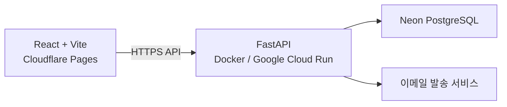

# MD2Blog 제품 및 아키텍처

## 1. 문서 목적

이 문서는 MD2Blog를 빠른 Markdown 변환 도구에서 사용자별 Markdown 기록장으로 확장하기 위한 제품 방향과 기술 결정을 정의합니다.

현재 제공 중인 빠른 변환 기능은 유지하며, 로그인 사용자는 같은 서비스에서 개인 기록장을 함께 이용할 수 있도록 확장합니다.

## 2. 제품 방향

### 2.1 빠른 변환

로그인 여부와 관계없이 현재 Markdown 변환 기능을 이용할 수 있습니다.

- Markdown 입력 및 파일 업로드
- 실시간 HTML 미리보기
- Mermaid 렌더링
- Mermaid 다이어그램별 PNG 복사
- 미리보기 내용 복사
- HTML 및 PDF 다운로드
- 네이버 블로그용 변환 옵션

변환 옵션은 별도의 적용 버튼 없이 변경 즉시 미리보기에 반영합니다.

미리보기 전체를 복사할 때 Mermaid 이미지는 용량과 블로그 호환성 문제를 방지하기 위해 제외하거나 자리 표시자로 대체합니다. 각 Mermaid 영역의 PNG 복사는 별도의 아이콘 버튼으로 제공합니다.

### 2.2 내 기록장

로그인 사용자는 Notion과 유사한 개인 Markdown 기록장을 이용할 수 있습니다.

- 최상위 페이지 추가
- 하위 페이지 추가
- 페이지 이동 및 정렬
- 페이지별 Markdown 작성
- 작성 내용 실시간 미리보기
- 계층형 페이지 탐색
- 자동 저장

비로그인 사용자가 `내 기록장` 메뉴를 선택하면 로그인 안내 화면을 표시합니다.

## 3. 화면 구성

데스크톱 화면은 상단 헤더와 왼쪽 사이드바를 함께 사용합니다.

- 상단 헤더: 서비스 브랜드, 계정 메뉴 등 전역 기능
- 왼쪽 사이드바: `빠른 변환`, `내 기록장`, 기록장 페이지 트리
- 중앙 편집 영역: Markdown 편집기
- 오른쪽 미리보기 영역: 렌더링 결과

로그인하지 않은 상태에서도 왼쪽 메뉴에는 `빠른 변환`과 `내 기록장`을 표시합니다. 모바일에서는 사이드바를 드로어 형태로 제공합니다.

## 4. 시스템 구성



### 4.1 프론트엔드

- React
- Vite
- TypeScript
- Cloudflare Pages 배포
- 빠른 변환은 로그인 없이 사용 가능
- 기록장 기능은 FastAPI 인증 및 기록장 API 사용

현재 요구사항은 검색 엔진 노출보다 애플리케이션 상호작용이 중요하므로 SSR을 목적으로 Next.js를 도입하지 않습니다.

### 4.2 백엔드

- Python
- FastAPI
- Docker 컨테이너
- Google Cloud Run 배포
- SQLAlchemy
- Alembic
- Pydantic

FastAPI는 인증, 사용자, 기록장, 페이지, 저장 등의 서버 기능을 담당합니다.

### 4.3 데이터베이스

- Neon PostgreSQL 사용
- 애플리케이션 서버와 DB를 분리해 운영
- Cloud Run 컨테이너 내부에서 PostgreSQL을 운영하지 않음

## 5. 백엔드 아키텍처

초기에는 마이크로서비스 대신 DDD 기반 모듈러 모놀리스로 구성합니다.

```text
backend/
├── app/
│   ├── modules/
│   │   ├── identity/
│   │   │   ├── domain/
│   │   │   ├── application/
│   │   │   ├── infrastructure/
│   │   │   └── presentation/
│   │   └── workspace/
│   │       ├── domain/
│   │       ├── application/
│   │       ├── infrastructure/
│   │       └── presentation/
│   ├── shared/
│   └── main.py
├── migrations/
├── tests/
│   ├── unit/
│   ├── integration/
│   └── acceptance/
├── Dockerfile
└── pyproject.toml
```

### 5.1 Bounded Context

#### Identity

- 사용자
- 비밀번호 자격 증명
- 로그인 세션
- 이메일 인증
- 비밀번호 재설정

#### Workspace

- 기록장
- 페이지
- 페이지 계층
- Markdown 본문
- 페이지 순서

### 5.2 의존성 규칙

- Domain은 FastAPI, SQLAlchemy, Pydantic에 의존하지 않습니다.
- Application은 유스케이스와 트랜잭션 경계를 정의합니다.
- Infrastructure는 DB, 암호화, 메일 등 외부 구현을 담당합니다.
- Presentation은 HTTP 요청과 응답을 애플리케이션 유스케이스에 연결합니다.
- SQLAlchemy 모델과 도메인 엔티티를 분리합니다.

## 6. 인증 설계

인증은 Neon Auth와 같은 외부 인증 서비스에 위임하지 않고 FastAPI에서 직접 구현합니다.

### 6.1 기본 정책

- 비밀번호 해싱: Argon2id
- Access Token: 수명이 짧은 JWT
- Refresh Token: 암호학적으로 안전한 무작위 토큰
- Refresh Token 전달: `HttpOnly`, `Secure`, 적절한 `SameSite`가 설정된 쿠키
- Refresh Token 저장: 원문이 아닌 해시 저장
- 토큰 갱신: Refresh Token Rotation 적용
- 로그아웃: 현재 세션 폐기
- 전체 로그아웃: 사용자의 모든 세션 폐기
- Access Token은 브라우저 `localStorage`에 장기 보관하지 않음

### 6.2 API 초안

```text
POST /auth/signup
POST /auth/login
POST /auth/refresh
POST /auth/logout
POST /auth/logout-all
GET  /auth/me

POST /auth/email-verification/request
POST /auth/email-verification/confirm
POST /auth/password-reset/request
POST /auth/password-reset/confirm
```

### 6.3 인증 테이블 초안

```text
users
- id
- email
- password_hash
- display_name
- email_verified_at
- status
- created_at
- updated_at

auth_sessions
- id
- user_id
- refresh_token_hash
- expires_at
- revoked_at
- user_agent
- ip_address
- created_at

email_verification_tokens
- id
- user_id
- token_hash
- expires_at
- used_at

password_reset_tokens
- id
- user_id
- token_hash
- expires_at
- used_at
```

## 7. 식별자 정책

모든 주요 엔티티의 식별자는 TSID(Time-Sorted Unique Identifier)를 사용합니다.

### 7.1 저장 및 전달

- Python 도메인 및 애플리케이션: TSID 값 객체
- PostgreSQL: `BIGINT`
- HTTP JSON: 문자열
- TypeScript: 브랜드 문자열 타입

JavaScript의 `number`는 64비트 정수를 안전하게 표현하지 못하므로 API에서 TSID를 숫자로 반환하지 않습니다.

```typescript
type TSID = string & { readonly __brand: "TSID" };
```

```json
{
  "id": "781839230418604291",
  "parentId": "781839200002013117"
}
```

Cloud Run의 여러 인스턴스에서 동시에 ID를 생성할 수 있으므로 충분한 랜덤 비트를 사용하는 검증된 TSID 구현체를 사용합니다. PostgreSQL의 기본 키 제약을 최종 충돌 방어선으로 둡니다.

## 8. TDD 전략

기능은 다음 순환으로 개발합니다.

```text
실패하는 테스트 작성
→ 최소 구현
→ 테스트 통과
→ 리팩터링
```

### 8.1 단위 테스트

- 도메인 엔티티
- 값 객체
- 도메인 규칙
- 애플리케이션 유스케이스
- 외부 시스템은 테스트 대역 사용

### 8.2 통합 테스트

- PostgreSQL Repository
- SQLAlchemy 매핑
- Alembic 마이그레이션
- 트랜잭션 경계
- TSID 저장 및 복원

SQLite로 PostgreSQL 동작을 대신하지 않고 테스트용 PostgreSQL을 사용합니다.

### 8.3 인수/API 테스트

- 회원가입부터 로그아웃까지의 인증 흐름
- Refresh Token 교체 및 재사용 차단
- 만료 및 폐기된 토큰 거부
- 다른 사용자의 페이지 접근 차단
- 상위·하위 페이지 생성과 이동
- Markdown 저장과 조회

## 9. 구현 단계

### 1단계: 프론트엔드 기반 정리

- React + Vite 애플리케이션 구조 확정
- 라우팅 추가
- 기존 빠른 변환 기능을 독립 화면으로 분리
- 공통 레이아웃과 사이드바 구성

### 2단계: FastAPI 기반 구축

- 백엔드 프로젝트와 Docker 구성
- DDD 모듈 구조 생성
- Neon PostgreSQL 연결
- Alembic 설정
- TSID 값 객체와 DB 타입 구현

### 3단계: 최소 인증

- 회원가입
- 로그인
- 토큰 갱신
- 현재 사용자 조회
- 현재 및 전체 세션 로그아웃

### 4단계: 기록장

- 페이지 생성, 조회, 수정, 삭제
- 하위 페이지
- 페이지 이동과 정렬
- 사용자별 접근 제어
- 자동 저장

### 5단계: 인증 확장

- 이메일 인증
- 비밀번호 재설정
- 로그인 제한
- 보안 감사 로그
- 필요할 경우 소셜 로그인

### 6단계: 배포 및 운영

- 프론트엔드 Cloudflare Pages 배포
- FastAPI Google Cloud Run 배포
- 운영용 Neon PostgreSQL 구성
- CORS, 쿠키 도메인 및 비밀 값 설정
- 로깅, 모니터링 및 백업 정책 구성

## 10. 확정 사항

| 항목 | 결정 |
|---|---|
| 프론트엔드 | React + Vite + TypeScript |
| SSR/Next.js | 현재 범위에서는 도입하지 않음 |
| 백엔드 | FastAPI |
| 백엔드 배포 | Docker + Google Cloud Run |
| 프론트엔드 배포 | Cloudflare Pages |
| 데이터베이스 | Neon PostgreSQL |
| 인증 | FastAPI 직접 구현 |
| 아키텍처 | DDD 기반 모듈러 모놀리스 |
| 개발 방법 | TDD |
| ID | TSID |
| DB ID 타입 | PostgreSQL `BIGINT` |
| API ID 타입 | 문자열 |

## 11. 추후 결정 사항

- 프론트엔드 라우터 및 상태 관리 도구
- Markdown 자동 저장 주기와 충돌 처리 방식
- 이메일 발송 서비스
- Access Token 전달 방식의 최종 선택
- CORS와 쿠키를 단순화할 커스텀 도메인 구조
- 페이지 삭제 정책과 휴지통 보존 기간
- 전문 검색 도입 여부
- 첨부 파일 저장소
- 협업 및 공유 기능의 범위
